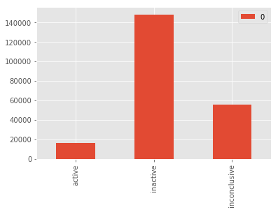
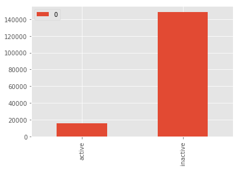
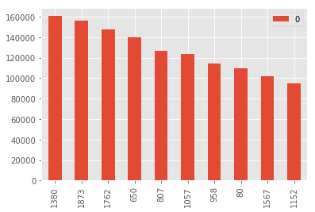
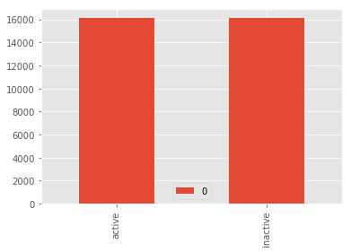
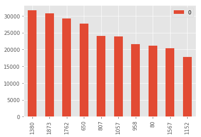
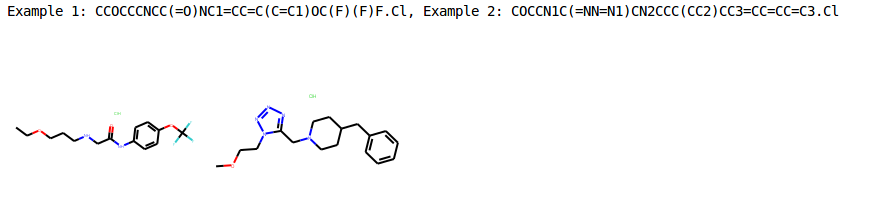
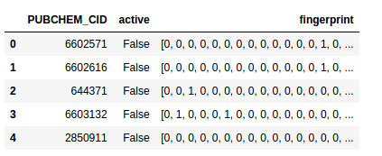
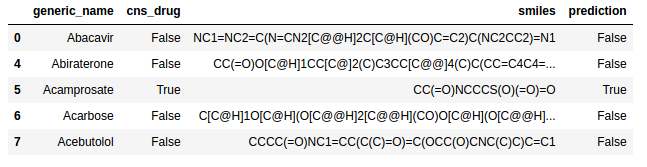

# Machine Learning Engineer Nanodegree
## Capstone Project
Joseph Heenan
September 19, 2017

## I. Definition

### Project Overview

Computational chemistry is the study of chemical structures and reactions using computer methods. This project focuses on applications of machine learning algorithms, in particular deep learning algorithms, to
the problem of 'virtual drug screening' in computational chemistry. This is the challenge of developing an algorithm that will give useful predictions as to which small molecule may interact meaningfully with a biological target relevant to human medicine.

Bioassays produce much of the data used by computational chemists; they are a form of high-throughput experiment in which many small molecule compounds are tested against a target biological system to determine which of them exhibits ‘bioactivity’ in that system. The definition of ‘bioactivity’ may vary from assay to assay but often means increased or decreased expression of a particular gene or protein.

There is a wealth of bioassay information hosted by the US National Institutes of Health at their [PubChem](https://pubchem.ncbi.nlm.nih.gov) site. As of the time this report was written, the Bioassay database at PubChem "...held over one million records holding 230,000,000 bioactivity outcomes deposited by over 80 organizations" (Wang, Yanli et al. 2017).

For this particular project we use the data that is available for Bioassay 1030, which looks at inhibitors for the gene ALDH1A1, a gene that is implicated in metabolic disorders, several cancers, and Parkinson's Disease (Anderson et al. 2001). Source data and medical background info is available [here](https://pubchem.ncbi.nlm.nih.gov/bioassay/1030). We utilize here the assay data table as well as a table with canonical module representations (referred to as 'SMILES' strings) as the base data for this project.

### Problem Statement

At a high level the problem we want to solve is that of drug discovery; that is, helping to discover new small-module medicines. More specifically, we want to create a binary classifier that, when given a sample module in an appropriately featurized format, will predict whether or not it will be active in inhibiting ALDH1A1. This predictor should be both sensitive and specific; we want to neither miss potential new medicies, nor do we want to spend time lab testing 'false positive' predictions that turn out not to be bioactive. This binary classifier will allow us to implement a type of 'virtual drug screening' where we can test a large library of modules which we may not yet be able to physically produce and test, in order to focus and steer future confirmatory laboratory testing.

The strategy I will use to attempt to find a sensitive and specific binary classifier is to experiment with several well-known machine learning algorithms from the packages of Scikit-Learn and Keras. I plan to take the following steps:

1. Ensure source data is properly merged and loaded, using the Pandas library
2. Ensure that source data is balanced (as per reviewer suggestions). Because over 90% of the bioactivity results are 'False' (not bioactive) a naive classifier could simply preduct 'False' and achieve high accuracy. I plan to use the imbalanced-learn package for sklearn to create a balanced dataset to help avoid this problem.
3. Ensure that proper mevaluation metrics are selected; I intend to use AUCROC score (area under curve for receiver operating characteristic curve) to compare different classifiers because this will help to ensure that both sensitivity and specificity are both considered during evaluation
4. Experiment with several different classifiers, specifically
	a) Decision Trees (sklearn)
	b) Random Forests (sklearn)
	c) Fully-Connected Deep Neural Networks (keras)

Because the bioassay 1030 presents a fully labelled dataset of 220,402 compounds tested, we will hold out a section of test data in order to evaluate the performance of the binary classifier.

I anticipate that the best solution to this problem may be found in the application of a deep learning algorithm, as these have shown best-in-class performance on several binary classification problems in recent years, e.g., the Cats vs Dogs problem on Kaggle linked [here](https://www.kaggle.com/c/dogs-vs-cats-redux-kernels-edition).

### Metrics

I plan to look at the metric of the average area under curve (AUC) score across two stratified folds of training for each of the models. This score (also sometimes referred to as area under ROC, for area under receiver operating curve) can be interpreted as providing "the probability of correctly ranking a (normal, abnormal) pair" (Hanley et al 1982). In this case it can be interpreted as "the probability of correctly ranking an (inactive, active) pair" of compound test results in the bioassay 1030.

Using this will provide an objective way to compare the performance of different models, while appropriately penalizing both "missed predictions" and "wrong predictions". This score also has the advantage that it is referenced in the MoleculeNet benchmark paper (Wu et al 2017), which provides a means of high-level comparison.


## II. Analysis

### Data Exploration

We conduct the majority of our exploratory analysis in the "pubchem_exploratory_analysis.ipynb" notebook.

We begin by exploring the characteristics of the class that we will use for training.

Here we note that there are 220,365 distinct observations with associated outcomes, and that the most frequent outcome is 'inactive', with 148,299 of the observations being inactive. The unique outcomes are "Active", "Inactive", and "Inconclusive". We note that the data are distributed as follows:

```python
Active: 16112, Inactive: 148299, Inconclusive: 55954
```
That is, we have 3 unique values for activity in the dataset, of which 'Inactive' is by far the most common with approx 148k of the values; there are approx 55k inconclusive outcomes and approx 16k active outcomes. We are now presented with two challenges:

1.  How do we engineer these three outcomes to fit in the desired binary classification scheme. Do we wish to drop the inconclusive results, or do we instead count them as 'inactive'? And:
2.  How do we handle the fact that the outcomes are highly imbalanced, e.g. the 'inactive' class is over 7 times larger than the 'active' class?

To answer the first point: our plan is to drop all of the 'inconclusive' values; this reduces the degree to which the dataset it imbalanced. We choose this class to drop based on the the assumption that the inconclusive datapoints contain the least amount of 'signal'. In the description page for this assay on PubChem, it notes that compounds that have a PUBCHEM_ACTIVITY_SCORE of 0 are classified as 'inactive'; scores of 40 and above are classified as 'active'; and all other scores are classified as 'inconclusive'.

To answer the second point: We plan to under-sample using the imblearn python package to obtain even representation of 'active' and 'inactive' when training, and compare the results between under-sampling and over-sampling. We will simply use random under-sampling as more advanced interpolation methods such as SMOTE perform poorly with regards to execution time on this dataset. We rule out using random over-sampling, because this technique can "corrupt" the test split of the data by duplicating data in the training split into the test split. Over-sampling is particularly dangerous on this dataset when testing deep neural network-based classifiers as the network may simply "memorize" the training samples (which are now duplicated in the test set), thus providing an inappropriate estimate of the model's ability to generalize.

We will use only 1 feature for training and predicting - that is the 2048-bit Morgan Fingerprint computed from the SMILES string for each compound. The featurization process converts the "SMILES" strings in the source CSV dataset into "Morgan fingerprints" (these are often also referred to as "circular fingerprints"). Each fingerprint is a sparse 2048-bit array that is computed for each molecule. Each bit in the bit array provides information as to the presence of a certain substructure within the overall molecule; a detailed overview of the technique used to calculate these fingerprints is beyond the scope of this paper, however an overview is available [here](http://www.daylight.com/dayhtml/doc/theory/theory.finger.html)

Regarding related datasets, the MoleculeNet benchmark [paper](https://arxiv.org/abs/1703.00564) deserves particular note, as it includes this bioassay 1030 as part of its list of 128 PubChem assay datasets that it analyzes. However the results are not directly comparable, as MoleculeNet looks at models that learn joint features via making a multi-task/multi-class prediction (e.g., for 1 SMILES string, it will predict bioactive or not against 128 different assay targets). Nevertheless it is important to reference this paper, as well as the 128-class [dataset](https://github.com/deepchem/deepchem/blob/master/datasets/pcba.csv.gz), as providing a reference point for this work. In that work, the authors report an AUC of .781 for the 128-class classification task.


### Exploratory Visualization


As discussed earlier, the root dataset is highly imbalanced. Below shows the original 3-class dataset:

<a href="" target="_blank"></a>

After we drop all inconclusive values, the dataset looks as follows:

<a href="" target="_blank"></a>

We look at the distribution of set bits in the feature/X (fingerprint) column, which consists of a 2048-bit fingerprint for each molecule:

<a href="" target="_blank"></a>

After we rebalance the dataset (to obtain even representation of inactive and active compounds) we have an y (activity) distribution as follows for our binary classifier:

<a href="" target="_blank"></a>

Our feature/X (fingerprint) column has a similar distribution of most common bits set, compared to before sampling:

<a href="" target="_blank"></a>

As can be seen, the dataset is now balanced in terms of the variable we are using for classification (activity), and the shape of the distribution of the most common set bits in the feature fingerprints has not changed significantly.

We also construct visualizations of the first two compounds which were tested in the assay:

<a href="" target="_blank"></a>

In this diagram, the title shows two example SMILES strings; the left molecule represents the molecule with the SMILES string for "Example 1" and the right molecule represents the molecule with the SMILES string for "Example 2". It is these SMILES strings that we use to derive the Morgan fingerprints discussed above.

### Algorithms and Techniques

I intend to look at a range of algorithms for solving this problem; specifically decision trees, random forests as well as deep (via KerasClassifier) neural networks to see how well the algorithms are able to classify the data. I avoid the use of support vector machine-based classifiers given the large size of the unsampled dataset. These algorithms are selected due to the fact that they are standard algorithms often used in machine learning papers, and can generally be expected to serve as a starting point for the discovery of a robust model.

### Benchmark

Because this is a novel analysis, there is no directly comparable benchmark available. For this reason I will compare my performance against that of a DummyClassifier with the default 'stratified' prediction strategy, which always makes predictions with resepect to the training dataset's class distribution. Using this classifier I obtain a benchmark ROC_AUC of .5. This score is no better than random chance fitted to the dataset, which is what we would expect for a 'dummy' classifier.

One partially-comparable benchmark is the MoleculeNet benchmark [paper](https://arxiv.org/abs/1703.00564) published by Wu et al in 2017; it notes an average area under curve for the receiver operating characteristic (ROC_AUC) of .781 for the test set of their model, which when given a SMILES string simultaneously predicts bioactivity on each of the 128 assays the model was trained on (this is what is meant by 'multi-task' in this context).

## III. Methodology

### Data Preprocessing

The unbalanced dataset needed to be corrected via random undersampling of the majority (inactive) class; oversampling techniques were avoided as the feature used for predictions (fingerprint) had no intuitive continuous formulation for interpolation via a technique such as SMOTE. Without interpolation we would have been forced to duplicate random minority class members, bringing with this the risk of "corrupting" the test dataset due to the fact that the model might "memorize" (and fail to generalize beyond) a training set that is partially or fully duplicated in the test set.

During pre-processing, one module that failed featurization was removed.

We further dropped the "inconslusive" datapoints to reduce ambiguous signal in the dataset and to facilitate analysis as a binary classification problem. From there we used RDKit to compute Morgan fingerprints for each compound in the assay. At the end of preprocessing, the data had the following form:

<a href="" target="_blank"></a>

Once in this form, we used the 'fingerprint' column as the input feature and attempted to predict the binary value of the 'active' column. The "PUBCHEM_CID" column provides an identifier for each compound that was tested for bioactivity against ALDH1A1

### Implementation

The implementation was carried out using scikit-learn and Keras. There were a number of challenges encountered during the implementation.  Initially I attempted to use several different values for the class_weight parameter available in scikit-learn classifiers to account for the imbalanced dataset, however this made little improvement in the ROC_AUC scores calculated. For this reason I focused the rest of my analysis on using an undersampled dataset which contained an even number of True and False class labels.

Another challenge was the size of the dataset and computational complexity of training deep neural networks; I found myself needing to use a GPU-equipped machine to train the Keras-based classifiers in a reasonable amount of time.

A further challenge was that the XGBoost library did not link properly on the evaluation machine and for this reason the XGBClassifier and xgboost algorithms could not be analyzed.

A final challenge was the large amount of memory required during the featurization process; many times almost all of the available 16 GB of RAM was in use.

The project consists of 3 Jupyter notebooks; the first, pubchem_exploratory_visualization, provides an exploratory overview of the dataset, wheras as pubchem_bioassay_sklearn contains the classifiers from sklearn and pubchem_dnn contains the classifiers built using Keras and trained on the Tensorflow backend.

### Refinement

I began with a Decision Tree-based classifier, and then progressed to implementing more advanced classifiers such as the LogisticRegression classifier as well as a RandomForest classifier.

The best initial solution that was found was the RandomForestClassifier; this was both relatively easy to implement and efficient to evaluate on the undersampled dataset. I increased the default number of estimators from the defaut of 10 to 100; this classifier achieved an ROC_AUC score of .743

Refinement of the deep neural network consisted of optimizing the number and size of fully-connected layers. I began with a network consisting of 2056, then 1024, then 512, then 256, then 1 neuron, however this achieved an ROC_AUC score of only .69. Based on this I updated the network topology to consist of simply a 2000-neuron layer followed by a 100 neuron layer followed by 1 output neuron, which achieved a  0.720 ROC_AUC score.

During the refinement process, I made sure to use k-fold cross-validation, so that I could be sure that my results were robust an not due to a particularly lucky or unluckly train-test split.

The process of refining the initial model is documented in the pubchem_bioassay_sklearn notebook [report](pubchem_bioassay_sklearn.html) and can be reproduced using the pubchem_bioassay_sklearn [notebook](pubchem_bioassay_sklearn.ipynb).


## IV. Results

### Model Evaluation and Validation

Overall I obtained the following results (all scores are the average over 2 stratified folds, with 1/3 of the data held out as the test set during each fold):

Model Name    | Avg ROC_AUC Score
------------- | -------------
DummyClassifier | .500
DecisionTreeClassifier  | .665
__RandomForestClassifier (100 estimators, other params default)__ | __.743__
LogisticRegression | .697
Deep Neural Network (3 layers, sizes 2000, 100, and 1) | .720

The best-performing classifier was the RandomForestClassifier with 100 estimators and all other parameters set to default values; it obtained an average ROC_AUC score of .743

I had expected the best classification model to be a deep neural network (DNN), per my proposed methodology, but was surprised that that the Random Forest documented in the Refinement section displayed the best performance. I believe the DNN failed to perform optimally due to the fact that the size of the dataset was significantly reduced due to the need to create balanced classes for training. I experimented with multiple deep neural network configurations using the Keras library but failed to obtain an ROC_AUC score better than .720 in any configuration, as can be seen in the [report](pubchem_dnn.html) and can be reproduced using the pubchem_dnn [notebook](pubchem_dnn.ipynb).

Due to the high ROC_AUC score obtained for the RandomForestRegressor model and the use of k-fold cross validation with k=2, I believe that this model can be trusted.

I additionally had hoped that building a classifier on top of a regressor might yield better results. This approach is promising as a scientist might run a prediction on a batch of compounds generated by an autoencoder such as that hosted by [ChEMBL](http://chembl.blogspot.de/2017/07/using-autoencoders-for-molecule.html), and improve the likelihood of finding a medicine by restricting lab testing to just those compounds was a regression score of greater than e.g. .9, however the attempt at using a DecisionTreeRegressor yielded no significant improvement in ROC_AUC, and as such this approach was abandoned.

### Justification


Given a benchmark AUC-ROC of .781 obtained by the MoleculeNet team (Wu et al 2017), I consider my AUC-ROC benchmark of .743 when using the RandomForestClassifier to be competitive. Additionally, the authors of the prior benchmark did not give performance information for the ALDH1A1 target in isolation, whereas I can document the performance of a targeted model which is able to predict compounds that inhibit the ALDH1A1 protein. I believe these results provide a model that improves the efficiency of the drug discovery process for inhibitors of ALDH1A1. As far as I know, this is the only open-source machine learning model that exists for this particular gene/protein combination.

## V. Conclusion

### Free-Form Visualization

For exploring the predictions of the model in a real-world setting, I downloaded a list of FDA-approved drugs and relevant SMILES strings from the website of the CureFFI foundation (a foundation dedicated to curing fatal familial insomnia); the dataset can be downloaded [here](http://www.cureffi.org/2013/10/04/list-of-fda-approved-drugs-and-cns-drugs-with-smiles/). I obtained a series of predictions on this dataset using the RandomForestClassifier trained on the last fold of the data. An excerpt of these results shows:

<a href="" target="_blank"></a>

From this one may take away that a person researching abnormal ALDH1A1 activity may want to ask a medical professional to further investigate Acamprosate.


### Reflection

In summary, I created a machine-learning pipeline encompassing data pre-processing, featurization and prediction under k-fold cross validation.

One interesting aspect of this project was that in completing it, I obtained a better understanding by what is meant by 'multi-task' classifiers; like a child that learns to sit by learning multiple sub-task at the same time (such as learning to lift his/her head, learning to arch his/her back, etc.), these models appear to learn generalized features about bioactivity across many disaparate targets at once. This phenomenon is further explored [here](http://pubs.acs.org/doi/abs/10.1021/acs.jcim.7b00087?journalCode=jcisd8)

The most difficult aspect of this project was the fact that the dataset was both uncomfortably large (before sampling) and uncomfortably small (after sampling) such that DNNs did not show significant performance improvements. Furthermore the training deep neural networks required significant setup time. In the end, however, I was pleased with the ease of use of the Keras library.

I believe that the final model and solution fits my expectations, and could be used in a production setting to help improve the efficiency of screening for novel compounds.

### Improvement

Unfortunately many of the high-throughput assays done of compounds of ALDH1A1 are not shared in an open format on PubChem. For instance, other inhibitors of the expressed products of this gene are documented [here](https://www.ncbi.nlm.nih.gov/pubmed/25634381) and [here](https://www.ncbi.nlm.nih.gov/pubmed/26207746), however I was not able to leverage this information in this model. For this reason, I believe that expanding the current datasets using these datasets could provide a performance improvement, however this is likely to require creating an HTML scraper that is beyond the scope of this project.

I do think that an even better solution exists; likely this solution will also look at bioassays related to similar genes/proteins and involve providing a deep neural network with a larger training dataset.

### Citations

Anderson, David W., et al. "Functional significance of aldehyde dehydrogenase ALDH1A1 to the nigrostriatal dopamine system." Brain research 1408 (2011): 81-87.
Hanley, James A., and Barbara J. McNeil. "The meaning and use of the area under a receiver operating characteristic (ROC) curve." Radiology 143.1 (1982): 29-36
Ramsunder, Bharath et. al. "Massively Multitask Networks for Drug Discovery". arXiv:1502.02072
Wang, Yanli et al. “PubChem BioAssay: 2017 Update.” Nucleic Acids Research 45.Database issue (2017): D955–D963. PMC. Web. 19 Sept. 2017.
Wu, Zhenquin et al. "MoleculeNet: A Benchmark for Molecular Machine Learning". arXiv:1703.00564

