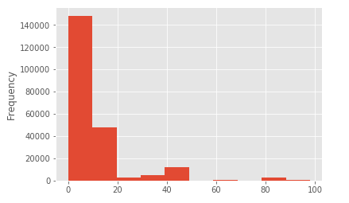
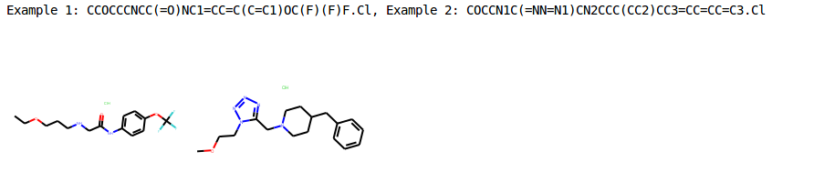
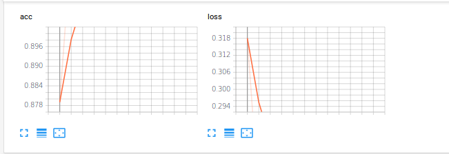
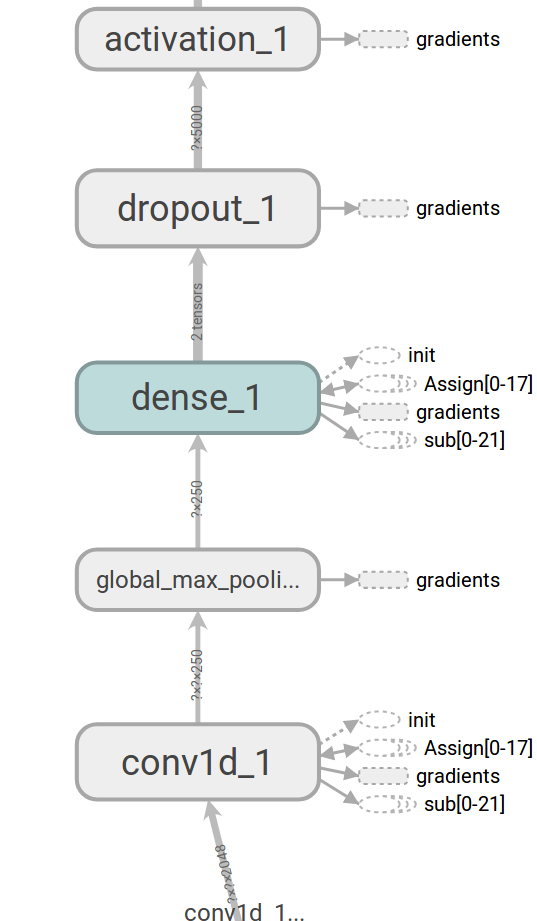

# Machine Learning Engineer Nanodegree
## Capstone Project
Joseph Heenan  
September 19, 2017

## I. Definition

### Project Overview

Computational chemistry is the study of chemical structures and reactions using computer methods. This project focuses on applications of machine learning algorithms, in particular deep learning algorithms, to
the problem of 'virtual drug screening' in computational chemistry. This is the challenge of developing an algorithm that will give useful predictions as to which small molecule may interact meaningfully with a biological target relevant to human medicine.

Bioassays produce much of the data used by computational chemists; they are a form of high-throughput experiment in which many small molecule compounds are tested against a target biological system to determine which of them exhibits ‘bioactivity’ in that system. The definition of ‘bioactivity’ may vary from assay to assay but often means increased or decreased expression of a particular gene or protein.

There is a wealth of bioassay information hosted by the US National Institutes of Health at their [PubChem](https://pubchem.ncbi.nlm.nih.gov) site. As of the time this report was written, the Bioassay database at PubChem "...held over one million records holding 230,000,000 bioactivity outcomes deposited by over 80 organizations" (Wang, Yanli et al. 2017). Clearly there is a wealth of well-labelled data available at this site. 

For this particular project, we use the data that is available for Bioassay 1030, which looks at inhibitors for the gene ALDH1A1, a gene that is implicated in metabolic disorders, several cancers, and Parkinson's Disease. The source data is available [here](https://pubchem.ncbi.nlm.nih.gov/bioassay/1030). We utilize here the assay data table as well as a table with canonical module representations (referred to as SMILES format) as the base data for this project.

### Problem Statement

At a high level the problem we want to solve is that of drug discovery; that is, helping to discover new small-module medicines. More specifically, we want to create a binary classifier that, when given a sample module in an appropriately featurized format, will predict whether or not it will be actice in inhibiting ALDH1A1. This predictor should be both sensitive and specific; we want to neither miss potential new medicies, nor do we want to spend time lab testing 'false positive' predictions that turn out not to be bioactive. This binary classifier will allow us to implement a type of 'virtual drug screening' where we can test a large library of modules which we may not yet be able to physically produce and test, in order to focus and steer future confirmatory laboratory testing.

The strategy I will use to attempt to find a sensitive and specific binary classifier is to experiment with several well-known machine learning algorithms from the packages of Scikit-Learn and Keras. I plan to take the following steps:


1. Ensure source data is properly merged loaded, using the Pandas library
2. Ensure that source data is balanced (as per reviewer suggestions). Because over 90% of the bioactivity results are 'False' (not bioactive) a naive classifier could simply preduct 'False' and achieve high accuracy. I plan to use the imbalanced-learn package for sklearn to create a balanced dataset to help avoid this problem.
3. Ensure that proper mevaluation metrics are selected; I intend to use the binary accuracy and F1 score metrics to compare different classifiers because this will help to ensure that sensitivity and specificity are both considered during evaluation
4. Experiment with several different classifiers, specifically
	a) Decision Trees (sklearn)
	b) Random Forests (sklearn)
	c) Fully-Connected Deep Neural Networks (keras)
5. Experiment with several different types of featurization for the above classifiers, such as Morgan fingerprints of different sizes, as well as trying to learn on the SMILES representation directly.
6. Experiment with optimization of model hyperparameters using a validation set

Because the bioassay 1030 presents a fully labelled dataset of 220,402 compounds tested, we will hold out a section of test data in order to evaluate the performance of the binary classifier. 

I anticipate that the best solution to this problem may be found in the application of a deep learning algorithm, as these have shown best-in-class performance on several binary classification problems in recent years, e.g., the Cats vs Dogs problem on Kaggle linked [here](https://www.kaggle.com/c/dogs-vs-cats-redux-kernels-edition).

In this section, you will want to clearly define the problem that you are trying to solve, including the strategy (outline of tasks) you will use to achieve the desired solution. You should also thoroughly discuss what the intended solution will be for this problem. Questions to ask yourself when writing this section.

### Metrics

I plan to examine the average F1 score across the two prediction class (True, e.g. predicted bioactive, and False, e.g. predicted not bioactive) for each of the models. Using this will provide an objective way to compare the performance of different models, while appropriately penalizing both "missed predictions" and "wrong predictions".


## II. Analysis

### Data Exploration

We conduct the majority of our exploratory analysis in the "pubchem_exploratory_analysis.ipynb" notebook.

We begin by exploring the characteristics of the class that we will use for training.

Here we note that there are 220,365 distinct observations with associated outcomes, and that the most frequent outcome is 'inactive', with 148,299 of the observations being inactive. The unique outcomes are "Active", "Inactive", and "Inconclusive". We note that the data are distributed as follows:

```python
Active: 16112, Inactive: 148299, Inconclusive: 55954
```
That is, we have 3 unique values for activity in the dataset, of which 'Inactive' is by far the most common with approx 148k of the values; there are approx 55k inconclusive outcomes and approx 16k active outcomes. We are now presented with two challenges:

1.  How do we engineer these three outcomes to fit in the desired binary classification scheme. Do we wish to drop the inconclusive results, or do we instead count them as 'inactive'? And:
2.  How do we handle the fact that the outcomes are highly imbalanced, e.g. the 'inactive' class is over 7 times larger than the 'active' class?

Our tentative plan is to coalese the 'Inactive' and 'Inconclusive' values, and to under-sample the 'inactive' class to obtain even representation of 'active' and 'inactive' when training, but we will return to this decision in the "featurization" step of our planned strategy later to determine whether this is optimal.

In terms of the fingerprints themselves, there are several domain-specific parameters which can be used to tune them; specifically the size of the bit array as well as the specific molecular features that should be used can be considered can be specified (such as chiral form and other domain-specific features). Given that prediction of activity against ALDH1A1 is still only partially-understood, we hope that tuning these parameters may result in a more robust model for future studies.

One other point of note is that the labelled dataset does contain activity scores for each compound in the form of a PUBCHEM_ACTIVITY_SCORE column. Active compounds are those with scores between 40 and 100, Inconclusive have scores between 40 and 1, and Inactive compounds have scores of 0. We also considered rephrasing the problem from one of binary classification (Active vs Inactive) to one of Linear Regression (predicting an activity score, and from that deriving a classification).

Regarding related datasets, the MoleculeNet benchmark [paper](https://arxiv.org/abs/1703.00564) deserves particular note, as it includes this bioassay as part of its list of 128 PubChem assay datasets that it analyzes. However the results are not directly comparable, as MoleculeNet looks at models that learn joint features via making a multi-task/multi-class prediction (e.g., for 1 SMILES string, it will predict bioactive or not against 128 different assay targets). Nevertheless it is important to reference this paper, as well as the 128-class [dataset](https://github.com/deepchem/deepchem/blob/master/datasets/pcba.csv.gz), as providing an important reference point for this work.


### Exploratory Visualization

As discussed earlier, the root dataset is highly imbalanced. Below is a histogram of the activity scores of each compound. Compounds with an activity score of 0 were classified as inactive in the original assay; scores from 0-40 were ranked as inconclusive; and scores from 40 and above were ranked as active. We can see that the great majority of the scores are under 40 (note; graphing configuration was unable to label axes directly, hence written descriptions):

<a href="" target="_blank"></a>

In the above diagram, the X axis shows the activity score, and the y axis shows the number of compounds falling without this bucket of e.g., 0-10 activity score, 10-20 activity score, etc.

We also construct visualizations of the first two compounds which were tested in the assay, in order to show how the SMILES string allows for reconstruction of a chemically-relevant entity:

<a href="" target="_blank"></a>

In this diagram, the title shows two example SMILES string; the left molecule represents the molecule with the SMILES string for "Example 1" and the right molecule represents the molecule with the SMILES string for "Example 2".

### Algorithms and Techniques

I intend to look at a range of algorithms for solving this problem; specifically decision trees, random forests as well as both shallow (via MLPClassifier) as well as deep (via KerasClassifier) neural networks to see how well the algorithms are able to classify the data. I avoid the use of support vector machine-based classifiers given the large size of the unsampled dataset. 

One particular challenge of this task is that it involves unbalanced learning, as postive results occurr in a ratio of approximately 1 positive result for every 9 negative results. If required I will undersample the dataset to achieve a balanced dataset for training.

### Benchmark

Because this is a novel analysis, there is no directly comparable benchmark available. For this reason I will look directly at F1 score metrics obtained, examining them on a class-by-class basis to ensure the model is not simply predicting 'false' to obtain a high F1 score.

One partially-comparable benchmark is the MoleculeNet benchmark [paper](https://arxiv.org/abs/1703.00564) published by Wu et al in 2017; it notes an area under curve for the receiver operating characteristic (AUC-ROC) of .781 for the test set of their model, which when given a SMILES string simultaneously predicts bioactivity on each of the 128 assays the model was trained on (this is what is meant by 'multi-task' in this context).

## III. Methodology

### Data Preprocessing

The unbalanced dataset abnormality needed to be corrected during preprocessing, as well as one module that failed featurization was removed.

Additionally we coalese the "inactive" and "inconclusive" activities into both "inactive" to make analysis and engineering effort less. We conduct some experimental regression analysis to see if modelling based on the raw activity scores provides much of a boost to the model, however we determine that it does not.

### Implementation

The implementation was carried out using scikit-learn and Keras. There were a number of challenges encountered during the implementation. Initially as a first step I created a Decision Tree classifier based on the raw dataset (without sampling) and was surprised to find a high cross-class F1-score of around .9. However when analyzed via the classification_report feature of scikit-learn, I realized this was due to excellent performance in nearly always predicting false for the label but with an F1 score for True class around .3; this meant little value however for a model that we want to have precision in finding new medicines. Initially I attempted to use several different values for the class_weight parameter available in scikit-learn classifiers however this made little improvement in the F1-score for the positive class. For this reason I focused the rest of my analysis on using an undersampled dataset which contained an even number of True and False class labels.

Another challenge was the size of the dataset and computational complexity of training deep neural networks; I found myself needing to use a GPU-equipped machine to train the Keras-based classifiers in a reasonable amount of time.

An additional challenge was implementing the regression model. A basic model was implemented in pubchem_regression_notsampled [report]("pubchem_regression_notsampled.html") and [notebook]("pubchem_regression_notsampled.ipynb")

A final challenge was the large amount of memory required during the featurization process; many times over 64 GB of RAM was used and models failed to train on the development virtual machine. For this reason as well, an undersampled dataset was generally used, except for in the experimental section on regression.

### Refinement

The best initial solution that was found was a RandomForestClassifier; this was both relatively easy to implement and efficient to evaluate on the undersampled dataset. This classifier achieved an average F1-score for the positive class of .70 under 2 folds of testing:

             precision    recall  f1-score   support

          0       0.70      0.72      0.71      8055
          1       0.72      0.69      0.70      8055
avg / total       0.71      0.71      0.71     16110

The F1-score for the negative class was also a respectable .71.

During the refinement process, I made sure to use k-fold cross-validation, so that I could be sure that my results were robust an not due to a particularly lucky or unluckly train-test split. I additionally used an open-source package, hyperopt-sklearn, to see if an algorithm could do a more efficient job of finding an optimal model than my manual analysis could. I did mark this section as experimental in case future evaluators have trouble reproducing it; it did not change my selected model.

The process of refining the initial model is documented in the pubchem_bioassay_sklearn notebook [report]("pubchem_bioassay_sklearn.html") and can be reproduced using the pubchem_bioassay_sklearn [notebook]("pubchem_bioassay_sklearn.ipynb").

## IV. Results

### Model Evaluation and Validation

I had expected the final classification model to come in the form of a deep neural network, per my proposed methodology, but was surprised that using a deep neural network on the classification dataset failed to yield better results than the Random Forest documented in the Refinement section. I believe this may be due to the fact that the effective size of the dataset was significantly reduced due to the need to create balanced classes for training; I went for a dataset of approximately 220,000 datapoints pre-processing, down to about 16,000 datapoints during the training process. I experimented with multiple deep neural network configurations using the Keras library but failed to obtain a average F1-score better than .68 in any configuration. A representative analysis is shown in the pubchem_dnn notebook [report]("pubchem_dnn.html") and can be reproduced using the pubchem_dnn [notebook]("pubchem_dnn.ipynb").

The model does appear to be robust in the face of perturbations of training/test data, as can be seen by comparable results during multiple folds of evaluation. Due to this, I believe that the model can be trusted.

I additionally had hoped that building a classifier on top of a regressor might yield better results. This approach is promising as a scientist might run a prediction on a batch of compounds generated by an autoencoder such as that hosted by [ChEMBL]("http://chembl.blogspot.de/2017/07/using-autoencoders-for-molecule.html"), and improve the likelihood of finding a medicine by restricting lab testing to just those compounds was a regression score of greater than e.g. .9, however the attempt at using a DecisionTreeRegressor yielded no significant improvement in f-score, and as such this approach was abandoned.

One interesting result is the running a convolutional neural network on the unbalanced dataset, such as in the pubchem_conv notebook, provided good accuracy in classifying false compounds, as can be seen by the following classification report:

precision    recall  f1-score   support

          0       0.94      0.96      0.95    102127
          1       0.30      0.21      0.25      8056
avg / total       0.89      0.91      0.90    110183

The reason for using a convolutional network was to attempt to reproduce the graph convolution approach of Ramsunder et al (2015), however this approach only yielded lift in terms of the negative classification but not in terms of identifying positive classes. The trained model might, however, be useful in terms of filtering out compounds in a pre-processing steps of a more robust pipeline, as the recall and support of .94 and .96 are both better than the .92 fraction of false results present in the initial dataset.


### Justification


Given a benchmark AUC-ROC of .781 obtained by the MoleculeNet team (Wu et al 2017), I consider my AUC-ROC benchmark of .709 when using the RandomForestClassifier to be competitive. Additionally, the authors of the prior benchmark do not give performance information for specifically the ALDH1A1 target, whereas I can state with confidence that I have created a targeted model which is able to predict inhibitors of ALDH1A1. I believe these results are significant enough to have solved the problem of providing a model that improves the efficiency of the drug discovery process for inhibitors of ALDH1A1. As far as I know, this is the only open-source machine learning model that exists for this particular gene and protein combination.

## V. Conclusion

### Free-Form Visualization

Given the high dimensionality of the 1024-bit feature vector provided by the RDKit [library](http://www.rdkit.org/), a visualization of the feature space directly is difficult to interpret, however, running Tensorboard on the output of the pubchem_conv experiment - linked are [report]("pubchem_conv.html") and [notebook]("pubchem_conv.ipynb") - gives a feeling for the shape of this model and the training rate. The first visualization shows the improvement to the binary classification accuracy, as well as reduction in binary categorical cross-entropy loss function, throughout the test run. Note: axes could not be labeled directly from Tensorboard. This is shown below:

<a href="" target="_blank"></a>

The architecture which helped archieve this is visualized, in part, below:

<a href="" target="_blank"></a>


### Reflection

In summary, I created a machine-learning pipeline encompassing data pre-processing, featurization and prediction under k-fold cross validation. 

One interesting aspect of this project was that in completing it, I obtained a better understanding by what is meant by 'multi-task' classifiers; like a child that learns to sit by learning multiple sub-task at the same time (such as learning to lift his/her head, learning to arch his/her back, etc.), these models appear to learn generalized features about bioactivity across many disaparate targets at once. This phenomenon is further explored [here](http://pubs.acs.org/doi/abs/10.1021/acs.jcim.7b00087?journalCode=jcisd8)

The most difficult aspect of this project was the fact that the dataset was both uncomfortably large (before sampling) and uncomfortably small (after sampling) such that DNNs did not show significant performance improvements. Additionally training deep neural networks required significant setup time. However I was pleased with the ease of use of the Keras library.

I believe that the final model and solution fits my expectations, and could be used in a production setting to help improve the efficiency of screening for novel compounds. One way to use the model would be to download a list of all currently approved drugs in a specific country like the US, as provided by [DrugBank](https://www.drugbank.ca/releases/5-0-8/downloads/approved-structures), and run them through the predictor to see if any might be helpful for persons suffering from diseases associated with ALDH1A1. 

### Improvement

Unfortunately many of the analyses of ALDH1A1 are not shared in an open format on PubChem. For this reason, I believe that using an NLP-based feature extractor could have a lot of value; increasing the size of the training dataset so that deep learning algorithms yield better results is the main change I'd like to make. For instance, other inhibitors of the expressed products of this gene are documented [here](https://www.ncbi.nlm.nih.gov/pubmed/25634381) and [here](https://www.ncbi.nlm.nih.gov/pubmed/26207746), however I was not able to leverage this information in this model. 

I do think that an even better solution exists; likely this solution will also look at bioassays related to similar genes/proteins, as well as using NLP to mine information not currently available in a structured form.

### Citations

Ramsunder, Bharath et. al. "Massively Multitask Networks for Drug Discovery". arXiv:1502.02072
Wang, Yanli et al. “PubChem BioAssay: 2017 Update.” Nucleic Acids Research 45.Database issue (2017): D955–D963. PMC. Web. 19 Sept. 2017.
Wu, Zhenquin et al. "MoleculeNet: A Benchmark for Molecular Machine Learning". arXiv:1703.00564

